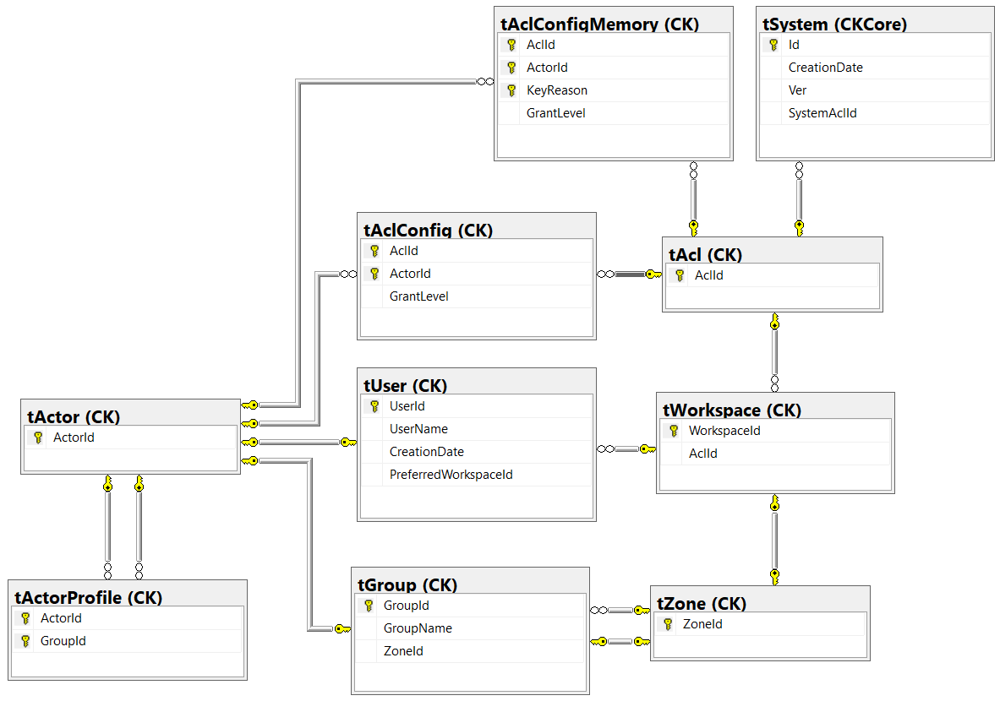

# CK.DB.Workspace

This package is based on the **CK.DB.Zone** that introduces Zone (a Zone is a Group that can contain one or more Groups),
on **CK.DB.Acl** that defines Access Control Lists and the fundamental `CK.vAclActor( AclId, ActorId, GrantLevel )` security view.

It adds Workspaces to the picture: a Workspace is a Zone with a Acl and an administrator Group.

The relational model of this package is as follows:



Workspace can be created and destroyed thanks to the `WorkspaceTable` methods:

```csharp
/// <summary>
/// Creates a new Workspace.
/// This is (by default) possible only for global Administrators (members of the Administrator group
/// which has the special reserved identifer 2).
/// </summary>
/// <param name="ctx">The call context to use.</param>
/// <param name="actorId">The acting user.</param>
/// <param name="workspaceName">The name of the workspace to create.</param>
/// <returns>The name and identifier of the new workspace and the default channel identifier.</returns>
[SqlProcedure( "sWorkspaceCreate" )]
public abstract NamedWorkspace CreateWorkspace( ISqlCallContext ctx, int actorId, string workspaceName );

/// <summary>
/// Destroys the Workspace.
/// This is possible only for workspace Administrators (i.e. the <paramref name="actorId"/> must have Administrator level (127)
/// on the workspace's acl.
/// </summary>
/// <param name="ctx">The call context to use.</param>
/// <param name="actorId">The acting user.</param>
/// <param name="workspaceId">The workspace identifier.</param>
/// <param name="forceDestroy">True to destroy the Zone even it is contains User or Groups (its Groups are destroyed).</param>
[SqlProcedure( "sWorkspaceDestroy" )]
public abstract void DestroyWorkspace( ISqlCallContext ctx, int actorId, int workspaceId, bool forceDestroy = false );
```

A `PreferredWorkspaceId` column is available on the `CK.tUser` table (and `CK.vUser` view).

This `CK.DB.Workspace.Package` provides an override of the user creation by adding the preferredWorkspaceId parameter (that defaults to 0 as usual)
that automatically adds the new user in its preferred workspace.

Any user's preferred workspace can also be modified using the `CK.DB.Workspace.Package.SetUserPreferredWorkspace` method.

Following rules are implemented. We don't consider them as *invariants* (they can be altered according to specific needs):

 - A Workspace can only be created by users that are at least SafeAdminitrator (112) on the System Acl (AclId=1).
 - The Workspace is granted 16 (Viewer) on its own Acl: any member of a workspace are guranteed to see the workspaces they belong to.
 - The Workspace's Administrators group is granted 127 (Administrator) on its own Acl: any member of this group has full control on the Workspace.
 - The SetUserPreferredWorkspace checks that the user is at least 16 (Viewer) on its new preferred workspace (note that only the GrantLevel is checked, not the fact that the user is a member of the workspace).
 - Only user that are Administrator (127) on a Workspace's Acl can destroy it.
 - When a Workspace is destroyed, users with the preferred workspace will have their `PreferredWorkspaceId` set to 0.

