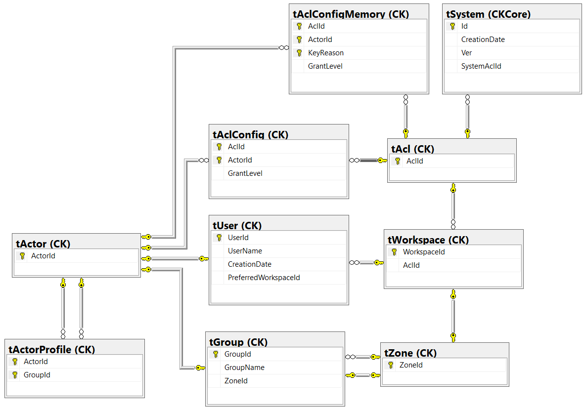

# CK.DB.Workspace

This package is based on the **CK.DB.Zone** zone management system presented in document CK-Database-2016-1.

The relational model of this package is as follows:



This package brings the CK.DB.WorkspaceTable, allowing to create and destroy a workspace. It brings a PreferredWorkspaceId column to the CK.tUser table and the view of the CK.tUser table, allowing to indicate the preferred workspace of a user. This package then provides an override of the user creation by adding the preferredWorkspaceId parameter.

```csharp
[SqlProcedure( "transform:sUserCreate" )]
public abstract Task<int> CreateUserAsync( ISqlCallContext ctx,
                                           int actorId,
                                           string userName,
                                           int preferredWorkspaceId );
```

The user's preferred workspace can also be modified using the CK.DB.Workspace.Package.SetUserPreferredWorkspaceAsync method.

```csharp
[SqlProcedure( "sUserPreferredWorkspaceIdSet" )]
public abstract Task SetUserPreferredWorkspaceAsync( ISqlCallContext ctx,
                                                     int actorId,
                                                     int userId,
                                                     int workspaceId );
```

When creating a workspace, a check is made to ensure that the actor has a GrantLevel of at least 112 on the Acl ID 1 system. Next, the zone and group representing the workspace are created. All workspace members will be added to this group. An Administrators group is also created, it gives all rights on the workspace. The creator of the workspace and the administrators group of the platform are automatically added.

When a workspace is destroyed, a check is made to ensure that the actor has a GrantLevel of 127 on his workspace Acl. All workspace users with this workspace as a favorite will have their preference reset to 0 in the PreferredWorkspaceId column of the CK.tUser table. Finally the groups and the workspace area will be destroyed.

When the database is created, a first workspace is created, the Platform Zone.
